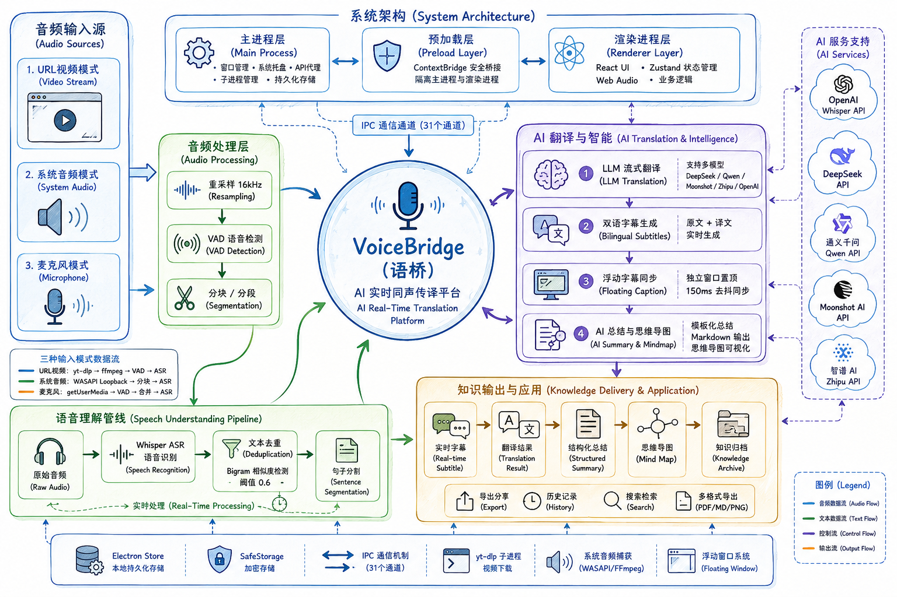

# VoiceBridge · 语桥

基于 Electron + React 构建的 AI 同声传译桌面应用，支持从视频 URL、系统音频或麦克风捕获语音，实时生成双语字幕并提供 AI 结构化总结与思维导图。


demo演示视频链接：https://pan.quark.cn/s/20b391d814ab
## 功能特性

### 音频输入
- **URL 模式**：输入视频链接（YouTube、B站等），通过 yt-dlp 提取音频并翻译
- **系统音频模式**：实时捕获系统音频输出进行同声传译
- **麦克风模式**：通过麦克风采集语音进行实时翻译

### 实时字幕
- **双语 / 仅中文** 双显示模式，一键切换
- **浮动字幕窗口**：紧凑/展开两种形态，始终置顶，适合屏幕共享或会议场景
- 浮动窗口与主窗口显示模式实时同步
- 自定义字体大小、颜色、背景透明度、最大行数

### AI 总结与思维导图
- **AI 总结提示词模板系统**：4 套内置预设 + 支持自定义模板
  - 通用思维导图 — 结构化知识整理
  - 会议纪要 — 突出决议与行动项
  - 课程笔记 — 知识体系化学习笔记
  - 访谈记录 — 核心观点与关键引用
- 翻译结束后自动生成结构化总结
- **交互式思维导图**：基于 markmap 渲染，支持缩放、自适应、全屏、PNG 导出

### 会话管理
- 翻译历史记录查看与搜索
- 会话详情弹窗：完整字幕回放 + AI 总结 + 思维导图
- 支持 Markdown 格式导出

### 安全与可靠性
- **存储加密**：敏感数据（API Key）使用 Electron safeStorage 加密存储
- **多域拆分**：配置 / 缓存 / 历史数据独立存储，互不干扰
- **写队列 + 版本化**：防止并发写入导致数据损坏，支持配置迁移
- **VAD 优化**：音频重叠检测、文本去重、句子级拆分，防止翻译结果交叉
- **竞态修复**：请求生命周期管控，防止过期结果覆盖

### 高度可定制
- AI 引擎配置（支持 OpenAI Whisper + DeepSeek / 兼容 OpenAI 协议的任意提供商）
- 字幕样式（字号、配色、背景、最大行数）
- 音频设置（输入设备、VAD 灵敏度、采样率）
- 主题切换（深色 / 浅色 / 跟随系统）

## 技术栈

| 层级 | 技术 |
|------|------|
| 桌面框架 | Electron 33 + electron-vite |
| 前端 | React 18 + TypeScript |
| UI 组件 | MUI 6 (Material Design) |
| 样式 | Tailwind CSS 3 + Emotion |
| 状态管理 | Zustand |
| 路由 | React Router 6 |
| 语音识别 | OpenAI Whisper API |
| 翻译引擎 | DeepSeek API (兼容 OpenAI 协议) |
| 思维导图 | markmap (markmap-lib + markmap-view + d3) |
| 音频提取 | yt-dlp |
| 存储 | electron-store + safeStorage |
| 构建 | Vite 5 + electron-builder |
| 测试 | Vitest + Testing Library |

## 项目结构

```
├── src/
│   ├── main/                      # Electron 主进程
│   │   ├── index.ts               # 应用入口、窗口管理 IPC
│   │   ├── window.ts              # BrowserWindow 创建与配置
│   │   ├── floating-subtitle.ts   # 浮动字幕窗口管理
│   │   ├── tray.ts                # 系统托盘
│   │   ├── ipc/                   # IPC 处理器
│   │   │   ├── index.ts           # IPC 注册入口
│   │   │   ├── audio.ipc.ts       # 系统音频/MIC 相关 IPC
│   │   │   ├── ytdlp.ipc.ts       # yt-dlp 音频提取 IPC
│   │   │   ├── ai.ipc.ts          # AI 翻译/摘要 IPC
│   │   │   ├── export.ipc.ts      # 导出 IPC
│   │   │   ├── auth.ipc.ts        # 平台认证 IPC
│   │   │   └── store.ipc.ts       # 安全存储 IPC
│   │   ├── services/              # 主进程服务
│   │   │   ├── system-audio.service.ts
│   │   │   ├── ytdlp.service.ts
│   │   │   ├── auth.service.ts    # 平台认证服务
│   │   │   ├── store.service.ts   # 加密存储 + 写队列服务
│   │   │   └── migrations.ts      # 配置版本迁移
│   │   └── utils/                 # 工具函数
│   │       ├── paths.ts           # 路径管理
│   │       ├── platform.ts        # 平台检测
│   │       └── log-encoding.ts    # Windows 控制台编码
│   ├── preload/                   # 预加载脚本（安全桥接）
│   ├── renderer/                  # React 渲染进程
│   │   ├── index.html             # 主窗口 HTML
│   │   ├── floating.html          # 浮动窗口 HTML
│   │   └── src/
│   │       ├── components/        # UI 组件
│   │       │   ├── Auth/          # 平台登录认证
│   │       │   ├── Common/        # 通用组件（控制栏、状态标签）
│   │       │   ├── DeviceSelector/# 音频设备选择器
│   │       │   ├── Layout/        # 布局（侧边栏、标题栏）
│   │       │   ├── ModeSelector/  # 输入模式切换
│   │       │   ├── Settings/      # 设置组件（模板编辑器、模板管理）
│   │       │   ├── Subtitle/      # 字幕面板 + 浮动字幕窗口
│   │       │   ├── Summary/       # AI 摘要面板 + 思维导图
│   │       │   └── URLInput/      # URL 输入面板
│   │       ├── hooks/             # React Hooks
│   │       ├── pages/             # 页面（首页、历史、设置）
│   │       ├── services/          # 前端服务层
│   │       └── store/             # Zustand 状态管理
│   └── shared/                    # 主进程与渲染进程共享代码
│       ├── types.ts               # TypeScript 类型定义 + 内置模板
│       ├── constants.ts           # 常量
│       ├── ipc-channels.ts        # IPC 通道名称
│       └── retry.ts               # 通用重试逻辑
├── docs/                          # 项目文档（PRD、架构设计）
├── resources/                     # 应用资源（图标、机制图）
├── electron.vite.config.ts        # electron-vite 构建配置
├── tailwind.config.js             # Tailwind CSS 配置
└── tsconfig*.json                 # TypeScript 配置
```

## 快速开始

### 环境要求

- Node.js >= 18
- npm >= 9
- Python >= 3.8（yt-dlp 音频提取依赖）
- 各平台 C++ 构建工具（编译 Electron 原生模块所需）

### Electron 环境安装

#### 1. 安装 Node.js

前往 [Node.js 官网](https://nodejs.org/) 下载 **LTS 版本**（>= 18），安装时勾选"Add to PATH"。

安装完成后验证：

```bash
node -v    # 应输出 v18.x.x 或更高
npm -v     # 应输出 9.x.x 或更高
```

> 推荐使用 [nvm](https://github.com/nvm-sh/nvm)（macOS/Linux）或 [nvm-windows](https://github.com/coreybutler/nvm-windows) 管理多版本 Node.js：
>
> ```bash
> nvm install 18
> nvm use 18
> ```

#### 2. 安装平台构建工具

Electron 的部分原生依赖（如 `electron-rebuild`）需要 C++ 编译环境：

**Windows**

```bash
npm install -g windows-build-tools
```

或手动安装 [Visual Studio Build Tools](https://visualstudio.microsoft.com/visual-cpp-build-tools/)，勾选"Desktop development with C++"工作负载。

**macOS**

```bash
xcode-select --install
```

**Linux (Ubuntu/Debian)**

```bash
sudo apt-get install -y build-essential libx11-dev libxkbfile-dev libsecret-1-dev
```

#### 3. 安装 Python（yt-dlp 依赖）

本项目使用 yt-dlp 提取视频音频，需要 Python 环境：

- **Windows**：前往 [Python 官网](https://www.python.org/downloads/) 下载安装，安装时勾选"Add Python to PATH"
- **macOS**：`brew install python3`
- **Linux**：`sudo apt-get install python3`

验证安装：

```bash
python3 --version   # 应输出 Python 3.8+
```

#### 4. 安装 yt-dlp

```bash
# 通过 pip 安装
pip install yt-dlp

# 或通过包管理器
# macOS
brew install yt-dlp
# Windows (scoop)
scoop install yt-dlp
# Linux
sudo apt-get install yt-dlp
```

验证安装：

```bash
yt-dlp --version
```

#### 5. 安装项目依赖并启动

完成以上环境准备后，回到项目目录：

```bash
# 克隆项目
git clone <仓库地址>
cd AI_transalater_and_summary

# 安装所有依赖（含 Electron）
npm install

# 启动开发模式
npm run dev
```

首次运行 `npm install` 时会自动下载 Electron 二进制文件（约 80MB），请确保网络通畅。如遇下载缓慢，可设置镜像源：

```bash
# 使用淘宝镜像
npm config set electron_mirror https://npmmirror.com/mirrors/electron/
npm install
```

### 开发模式

```bash
npm run dev
```

### 构建打包

```bash
npm run build         # 仅构建
npm run package       # 构建 + 打包为可分发安装包
npm run package:win   # 构建 + Windows 安装包
```

### 类型检查

```bash
npm run typecheck        # 全量检查（node + web）
npm run typecheck:node   # 仅主进程
npm run typecheck:web    # 仅渲染进程
```

### 运行测试

```bash
npm run test             # 运行全部测试
npm run test:watch       # 监听模式
```

## 配置说明

应用启动后进入 **设置页面**，需配置以下 API 密钥：

| 服务 | 用途 | 默认模型 |
|------|------|----------|
| OpenAI Whisper | 语音转文字 | `whisper-1` |
| DeepSeek | 文本翻译 + 摘要 | `deepseek-v4-flash` |

> 翻译引擎兼容 OpenAI 协议，可替换为任意兼容的 API 提供商。

### 总结模板配置

在设置页面可管理 AI 总结模板：
- 4 套内置模板适用于不同场景（通用/会议/课程/访谈）
- 支持创建自定义模板，定义 System Prompt 和用户消息模板
- 翻译过程中可即时切换模板，无需中断

## 许可证

MIT

