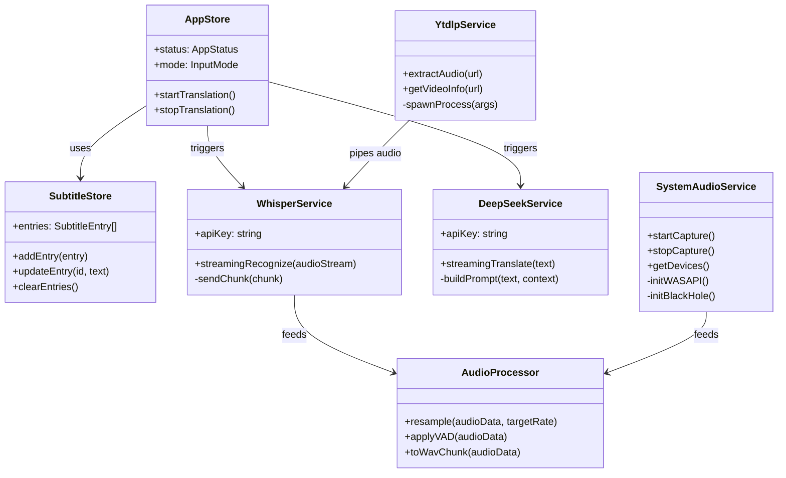
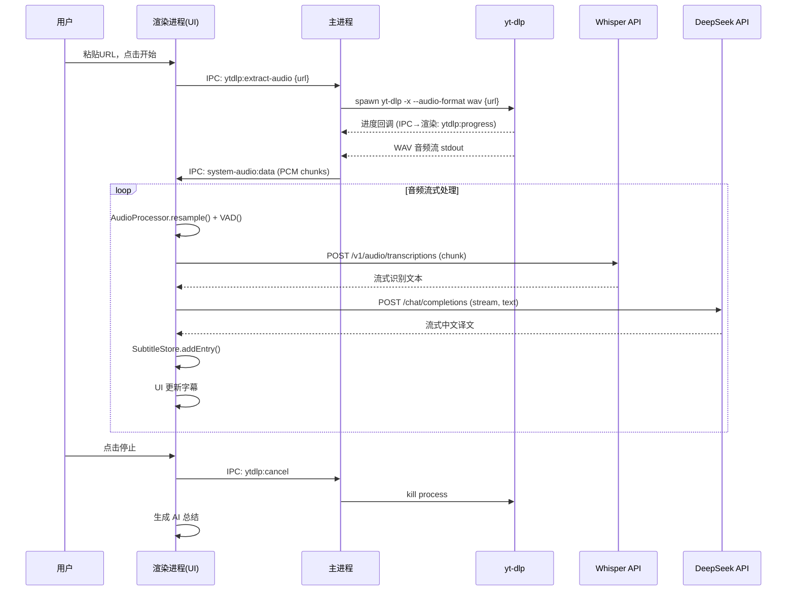
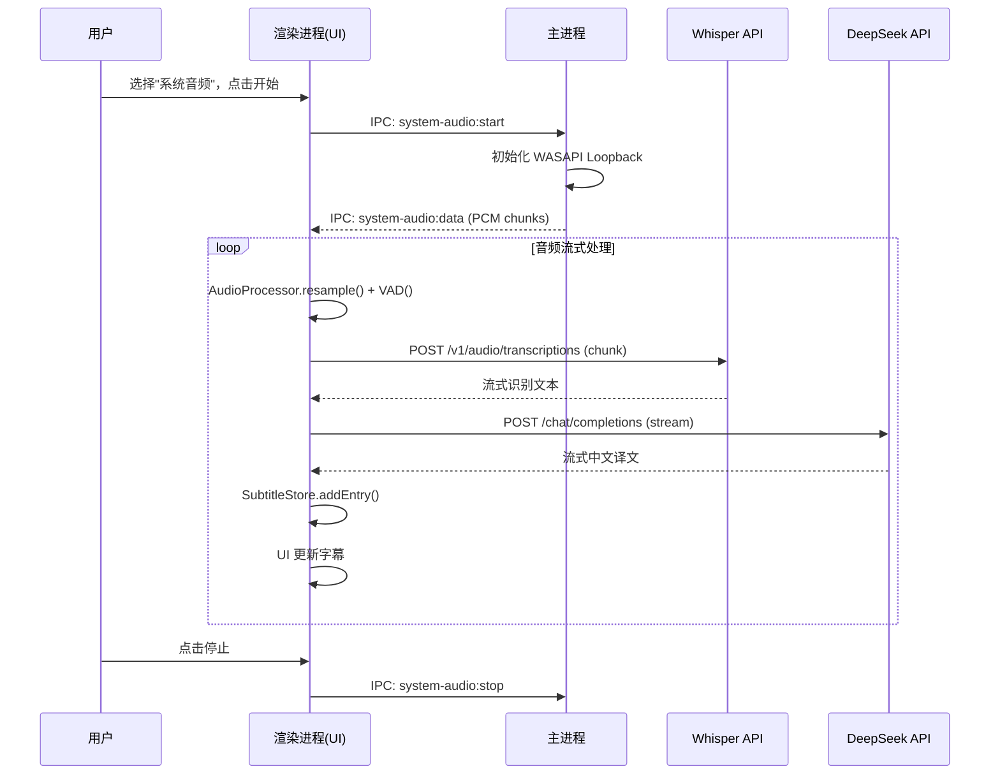
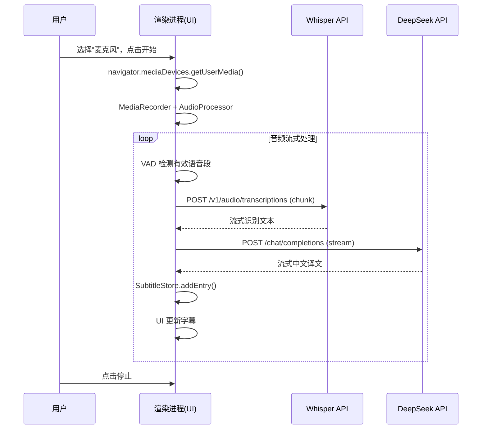

# AI 同声传译桌面助手 — 系统架构设计

> **版本**: v1.0  
> **架构师**: 齐活林 (代高见远)  
> **日期**: 2025-06-05  
> **状态**: 待评审

---

## 1. 框架选型与构建工具

| 类别 | 选型 | 版本 | 理由 |
|------|------|------|------|
| **桌面框架** | Electron | ^33.x | 主进程可调用 Node 原生模块（yt-dlp、WASAPI）；渲染进程 Web Audio API 开箱即用；跨平台成熟 |
| **前端框架** | React 18 + TypeScript | ^18.x | 组件化开发，Hooks 适合流式数据更新场景 |
| **构建工具** | Vite + electron-vite | latest | electron-vite 为 Electron 定制 Vite 配置，HMR 快，开箱即用 |
| **UI 组件库** | MUI (Material UI) | ^6.x | 开源免费，组件丰富，主题定制灵活 |
| **CSS 方案** | Tailwind CSS | ^3.x | 原子化 CSS，快速布局 |
| **状态管理** | Zustand | ^4.x | 轻量，适合流式数据订阅场景 |
| **IPC 通信** | electron-vite 内置 ipcRenderer/ipcMain | - | 类型安全的 Electron IPC |
| **音频处理(渲染进程)** | Web Audio API + MediaRecorder | - | 浏览器原生麦克风采集 |
| **音频处理(主进程)** | node-portaudio / windows-audio-capture | - | 主进程系统音频捕获 |
| **HTTP 流式请求** | fetch (SSE) / openai SDK | - | Whisper/DeepSeek 流式 API |
| **本地存储** | electron-store + better-sqlite3 | - | electron-store 存设置；SQLite 存翻译历史 |
| **yt-dlp 集成** | yt-dlp-wrap | ^2.x | Node.js 封装 yt-dlp 子进程调用 |
| **日志** | electron-log | ^5.x | Electron 日志方案 |

---

## 2. 文件结构

```
ai-interpreter-desktop/
├── package.json
├── electron.vite.config.ts
├── tsconfig.json
├── tsconfig.node.json
├── tsconfig.web.json
├── tailwind.config.js
├── postcss.config.js
├── .gitignore
├── README.md
│
├── resources/                    # 应用资源（打包进 asar）
│   └── bin/
│       ├── yt-dlp.exe           # Windows yt-dlp 二进制
│       ├── yt-dlp               # macOS yt-dlp 二进制
│       └── ffmpeg.exe           # Windows ffmpeg（yt-dlp 依赖）
│
├── src/
│   ├── main/                    # Electron 主进程
│   │   ├── index.ts             # 主进程入口
│   │   ├── window.ts            # 窗口管理
│   │   ├── tray.ts              # 系统托盘
│   │   ├── ipc/                 # IPC Handler 注册
│   │   │   ├── index.ts         # 统一注册
│   │   │   ├── audio.ipc.ts     # 音频相关 IPC
│   │   │   ├── ytdlp.ipc.ts     # yt-dlp 相关 IPC
│   │   │   ├── store.ipc.ts     # 存储相关 IPC
│   │   │   └── export.ipc.ts    # 导出相关 IPC
│   │   ├── services/            # 主进程业务服务
│   │   │   ├── ytdlp.service.ts         # yt-dlp 子进程管理
│   │   │   ├── system-audio.service.ts  # 系统音频捕获 (WASAPI/BlackHole)
│   │   │   └── export.service.ts        # Markdown 导出
│   │   └── utils/
│   │       ├── paths.ts         # 资源路径解析
│   │       └── platform.ts      # 平台检测工具
│   │
│   ├── preload/                 # Preload 脚本
│   │   ├── index.ts             # preload 入口
│   │   └── index.d.ts          # 类型声明（暴露给渲染进程的 API）
│   │
│   ├── renderer/                # Electron 渲染进程 (React)
│   │   ├── index.html           # HTML 入口
│   │   ├── main.tsx             # React 入口
│   │   ├── App.tsx              # 根组件
│   │   ├── assets/              # 静态资源
│   │   │   └── styles/
│   │   │       └── global.css   # Tailwind 全局样式
│   │   ├── components/          # 通用 UI 组件
│   │   │   ├── Layout/
│   │   │   │   ├── AppLayout.tsx        # 应用整体布局
│   │   │   │   ├── TitleBar.tsx         # 自定义标题栏
│   │   │   │   └── Sidebar.tsx          # 侧边导航
│   │   │   ├── Subtitle/
│   │   │   │   ├── SubtitlePanel.tsx    # 字幕面板（主窗口内）
│   │   │   │   ├── SubtitleLine.tsx     # 单条字幕行（原文+译文）
│   │   │   │   └── FloatingSubtitle.tsx # 浮动字幕窗口
│   │   │   ├── ModeSelector/
│   │   │   │   └── ModeTabs.tsx         # 模式切换 Tab
│   │   │   ├── URLInput/
│   │   │   │   └── URLInputPanel.tsx    # URL 输入面板
│   │   │   ├── DeviceSelector/
│   │   │   │   └── DeviceSelector.tsx   # 音频设备选择
│   │   │   ├── Summary/
│   │   │   │   └── SummaryPanel.tsx     # AI 总结预览面板
│   │   │   └── Common/
│   │   │       ├── StatusBadge.tsx      # 状态指示器
│   │   │       └── ControlBar.tsx       # 开始/暂停/停止控制栏
│   │   ├── pages/               # 页面组件
│   │   │   ├── HomePage.tsx             # 主页（翻译工作台）
│   │   │   ├── HistoryPage.tsx          # 翻译历史
│   │   │   └── SettingsPage.tsx         # 设置页
│   │   ├── hooks/               # 自定义 Hooks
│   │   │   ├── useAudioCapture.ts       # 麦克风音频采集
│   │   │   ├── useWhisperASR.ts         # Whisper ASR 流式调用
│   │   │   ├── useDeepSeekTranslate.ts  # DeepSeek 流式翻译
│   │   │   ├── useSubtitle.ts           # 字幕状态管理
│   │   │   └── useSummary.ts            # AI 总结
│   │   ├── services/            # 渲染进程服务
│   │   │   ├── whisper.service.ts       # Whisper API 封装
│   │   │   ├── deepseek.service.ts      # DeepSeek API 封装
│   │   │   └── audio-processor.ts       # 音频前处理（重采样、VAD）
│   │   ├── store/               # Zustand 状态管理
│   │   │   ├── appStore.ts              # 全局应用状态
│   │   │   ├── subtitleStore.ts         # 字幕数据状态
│   │   │   └── settingsStore.ts         # 设置状态
│   │   ├── types/               # TypeScript 类型定义
│   │   │   ├── audio.ts                 # 音频相关类型
│   │   │   ├── subtitle.ts              # 字幕相关类型
│   │   │   ├── api.ts                   # API 响应类型
│   │   │   └── ipc.ts                   # IPC 通道类型
│   │   └── utils/
│   │       ├── audio-utils.ts           # 音频工具函数
│   │       └── markdown-exporter.ts     # Markdown 格式化导出
│   │
│   └── shared/                  # 主进程/渲染进程共享
│       ├── types.ts             # 共享类型定义
│       ├── constants.ts         # 共享常量（IPC 通道名等）
│       └── ipc-channels.ts      # IPC 通道名枚举
│
└── scripts/                     # 构建/开发脚本
    ├── download-ytdlp.ts        # 下载 yt-dlp 二进制
    └── dev.ts                   # 开发启动脚本
```

---

## 3. 核心接口与数据结构

### 3.1 共享类型定义 (`src/shared/types.ts`)

```typescript
// ===== 音频输入模式 =====
export type InputMode = 'url' | 'system-audio' | 'microphone';

// ===== 应用状态 =====
export type AppStatus = 'idle' | 'connecting' | 'listening' | 'translating' | 'error';

// ===== 字幕条目 =====
export interface SubtitleEntry {
  id: string;
  timestamp: number;          // 毫秒时间戳
  originalText: string;       // 原文
  translatedText: string;     // 译文
  isFinal: boolean;           // 是否为最终结果（非流式中间态）
  correctedFrom?: string;     // 修正前的文本（自动修正用）
  mode: InputMode;            // 来源模式
}

// ===== 翻译会话 =====
export interface TranslationSession {
  id: string;
  mode: InputMode;
  sourceUrl?: string;         // URL 模式下的视频地址
  sourceLanguage: string;     // 源语言
  targetLanguage: string;     // 目标语言
  startTime: number;
  endTime?: number;
  subtitles: SubtitleEntry[];
  summary?: string;           // AI 总结（Markdown）
}

// ===== AI 引擎配置 =====
export interface AIEngineConfig {
  whisper: {
    provider: 'openai';       // V1 仅支持 OpenAI
    apiKey: string;
    model: string;            // whisper-1
    language?: string;        // 源语言提示
  };
  translator: {
    provider: 'deepseek';
    apiKey: string;
    model: string;            // deepseek-chat
    baseUrl: string;          // https://api.deepseek.com
  };
}

// ===== 应用设置 =====
export interface AppSettings {
  ai: AIEngineConfig;
  subtitle: {
    fontSize: number;
    originalColor: string;
    translatedColor: string;
    backgroundColor: string;
    backgroundOpacity: number;
    maxLines: number;
  };
  audio: {
    inputDevice: string;
    vadSensitivity: 'low' | 'medium' | 'high';
    sampleRate: number;       // 16000
  };
  general: {
    theme: 'light' | 'dark' | 'system';
    language: string;
  };
}
```

### 3.2 IPC 通道定义 (`src/shared/ipc-channels.ts`)

```typescript
export const IPC_CHANNELS = {
  // yt-dlp
  YTDLP_EXTRACT_AUDIO: 'ytdlp:extract-audio',
  YTDLP_GET_INFO: 'ytdlp:get-info',
  YTDLP_CANCEL: 'ytdlp:cancel',
  YTDLP_PROGRESS: 'ytdlp:progress',      // 主→渲染：进度

  // 系统音频
  SYSTEM_AUDIO_START: 'system-audio:start',
  SYSTEM_AUDIO_STOP: 'system-audio:stop',
  SYSTEM_AUDIO_DATA: 'system-audio:data',  // 主→渲染：PCM 数据
  SYSTEM_AUDIO_DEVICES: 'system-audio:devices',

  // 存储
  STORE_GET: 'store:get',
  STORE_SET: 'store:set',

  // 导出
  EXPORT_MARKDOWN: 'export:markdown',
  EXPORT_DIALOG: 'export:dialog',

  // 窗口控制
  WINDOW_MINIMIZE: 'window:minimize',
  WINDOW_MAXIMIZE: 'window:maximize',
  WINDOW_CLOSE: 'window:close',
} as const;
```

### 3.3 类图



---

## 4. 程序调用流程

### 4.1 整体架构

```
┌─────────────────────────────────────────────────────────┐
│                    Electron 主进程                        │
│  ┌────────────┐  ┌──────────────┐  ┌────────────────┐  │
│  │ yt-dlp     │  │ 系统音频捕获  │  │ 文件导出/存储   │  │
│  │ Service    │  │ Service      │  │ Service        │  │
│  └─────┬──────┘  └──────┬───────┘  └────────────────┘  │
│        │                │                               │
│        │  IPC Bridge    │                               │
└────────┼────────────────┼───────────────────────────────┘
         │                │
┌────────┼────────────────┼───────────────────────────────┐
│        ▼                ▼                               │
│  ┌──────────────────────────────┐  ┌────────────────┐   │
│  │     渲染进程 (React)         │  │  Zustand Store │   │
│  │                              │  │  ├─ appStore   │   │
│  │  ┌─────────┐  ┌──────────┐  │  │  ├─ subtitle   │   │
│  │  │Whisper  │  │DeepSeek  │  │  │  └─ settings   │   │
│  │  │Service  │  │Service   │  │  └────────────────┘   │
│  │  └────┬────┘  └────┬─────┘  │                       │
│  │       │            │        │  ┌────────────────┐   │
│  │       ▼            ▼        │  │  UI Components │   │
│  │  ┌──────────────────────┐   │  │  ├─ Subtitle   │   │
│  │  │  Audio Processor     │   │  │  ├─ Summary    │   │
│  │  │  (VAD / 重采样)      │   │  │  └─ Controls   │   │
│  │  └──────────────────────┘   │  └────────────────┘   │
│  │                              │                       │
│  │  ┌──────────────────────┐   │                       │
│  │  │  麦克风采集           │   │                       │
│  │  │  (Web Audio API)     │   │                       │
│  │  └──────────────────────┘   │                       │
│  └──────────────────────────────┘                       │
│                   Electron 渲染进程                      │
└─────────────────────────────────────────────────────────┘
```

### 4.2 URL 模式时序图



### 4.3 系统音频模式时序图



### 4.4 麦克风模式时序图



---

## 5. 任务列表

按实现顺序排列，标注依赖关系和涉及文件。

### Phase 1: 项目脚手架

| # | 任务 | 涉及文件 | 依赖 | 优先级 |
|---|------|---------|------|--------|
| T01 | 初始化 Electron + Vite + React + TS 项目 | `package.json`, `electron.vite.config.ts`, `tsconfig.*.json` | 无 | P0 |
| T02 | 配置 Tailwind CSS + MUI | `tailwind.config.js`, `postcss.config.js`, `src/renderer/assets/styles/global.css` | T01 | P0 |
| T03 | 定义共享类型和 IPC 通道 | `src/shared/types.ts`, `src/shared/ipc-channels.ts`, `src/shared/constants.ts` | T01 | P0 |
| T04 | 主进程入口 + 窗口管理 + Preload | `src/main/index.ts`, `src/main/window.ts`, `src/preload/index.ts`, `src/preload/index.d.ts` | T01 | P0 |

### Phase 2: 核心 UI 框架

| # | 任务 | 涉及文件 | 依赖 | 优先级 |
|---|------|---------|------|--------|
| T05 | 应用布局 + 自定义标题栏 + 侧边导航 | `AppLayout.tsx`, `TitleBar.tsx`, `Sidebar.tsx` | T02 | P0 |
| T06 | 模式切换 Tab + URL 输入面板 | `ModeTabs.tsx`, `URLInputPanel.tsx` | T05 | P0 |
| T07 | 设备选择器（麦克风/系统音频） | `DeviceSelector.tsx` | T05 | P0 |
| T08 | 字幕面板组件 | `SubtitlePanel.tsx`, `SubtitleLine.tsx` | T05 | P0 |
| T09 | 控制栏（开始/暂停/停止） | `ControlBar.tsx`, `StatusBadge.tsx` | T05 | P0 |
| T10 | Zustand Store 基础 | `appStore.ts`, `subtitleStore.ts`, `settingsStore.ts` | T03 | P0 |

### Phase 3: 音频采集管线

| # | 任务 | 涉及文件 | 依赖 | 优先级 |
|---|------|---------|------|--------|
| T11 | yt-dlp 服务 + IPC（主进程） | `ytdlp.service.ts`, `ytdlp.ipc.ts`, `paths.ts`, `platform.ts` | T04 | P0 |
| T12 | yt-dlp 二进制下载脚本 + 资源打包 | `scripts/download-ytdlp.ts`, `resources/bin/*` | T11 | P0 |
| T13 | 系统音频捕获服务（主进程） | `system-audio.service.ts`, `audio.ipc.ts` | T04 | P0 |
| T14 | 麦克风采集 Hook（渲染进程） | `useAudioCapture.ts`, `audio-processor.ts`, `audio-utils.ts` | T10 | P0 |
| T15 | 音频前处理：重采样 + VAD | `audio-processor.ts`, `audio-utils.ts` | T14 | P0 |

### Phase 4: AI 引擎集成

| # | 任务 | 涉及文件 | 依赖 | 优先级 |
|---|------|---------|------|--------|
| T16 | Whisper API 流式调用服务 | `whisper.service.ts`, `useWhisperASR.ts` | T15, T10 | P0 |
| T17 | DeepSeek 流式翻译服务 | `deepseek.service.ts`, `useDeepSeekTranslate.ts` | T16, T10 | P0 |
| T18 | 字幕状态管理 + 自动修正 | `useSubtitle.ts`, `subtitleStore.ts` (更新) | T17 | P0 |

### Phase 5: 翻译历史 + 导出

| # | 任务 | 涉及文件 | 依赖 | 优先级 |
|---|------|---------|------|--------|
| T19 | 本地存储（electron-store + SQLite） | `store.ipc.ts`, `src/main/services/storage.service.ts` | T04 | P0 |
| T20 | 翻译历史页面 | `HistoryPage.tsx` | T19, T08 | P0 |
| T21 | Markdown 导出服务 | `export.service.ts`, `export.ipc.ts`, `markdown-exporter.ts` | T19 | P1 |
| T22 | AI 智能总结 Hook + 面板 | `useSummary.ts`, `SummaryPanel.tsx` | T17 | P1 |

### Phase 6: 设置 + 系统托盘 + 优化

| # | 任务 | 涉及文件 | 依赖 | 优先级 |
|---|------|---------|------|--------|
| T23 | 设置页面（字幕/AI引擎/音频） | `SettingsPage.tsx` | T10 | P1 |
| T24 | 浮动字幕窗口 | `FloatingSubtitle.tsx` | T08 | P1 |
| T25 | 系统托盘 | `tray.ts` | T04 | P1 |
| T26 | 打包配置（electron-builder） | `electron-builder.yml` | 全部 | P0 |

---

## 6. 依赖包列表

### 生产依赖 (dependencies)

```json
{
  "@mui/material": "^6.x",
  "@mui/icons-material": "^6.x",
  "@emotion/react": "^11.x",
  "@emotion/styled": "^11.x",
  "react": "^18.x",
  "react-dom": "^18.x",
  "react-router-dom": "^6.x",
  "zustand": "^4.x",
  "electron-store": "^8.x",
  "better-sqlite3": "^11.x",
  "yt-dlp-wrap": "^2.x",
  "electron-log": "^5.x"
}
```

### 开发依赖 (devDependencies)

```json
{
  "electron": "^33.x",
  "electron-vite": "^2.x",
  "electron-builder": "^24.x",
  "typescript": "^5.x",
  "vite": "^5.x",
  "@vitejs/plugin-react": "^4.x",
  "tailwindcss": "^3.x",
  "postcss": "^8.x",
  "autoprefixer": "^10.x",
  "@types/react": "^18.x",
  "@types/react-dom": "^18.x",
  "@types/better-sqlite3": "^7.x"
}
```

---

## 7. 共享知识（跨文件约定）

### 命名规范
- 文件名：kebab-case (`audio-processor.ts`)
- 组件文件：PascalCase (`SubtitlePanel.tsx`)
- Hook 文件：camelCase 前缀 use (`useWhisperASR.ts`)
- IPC 通道：`namespace:action` (`ytdlp:extract-audio`)
- Store：`xxxStore.ts`，导出 `useXxxStore` hook
- Service：`xxx.service.ts`，导出 class 或单例

### 音频数据流约定
- 所有音频在管线中以 **Float32Array** 传递（PCM 32-bit float）
- 采样率统一为 **16000 Hz**（Whisper 要求）
- 音频分块大小：**30 秒** 一个 chunk 发送 Whisper
- VAD 静音阈值：可配置，默认 -40dB

### API 调用约定
- Whisper：使用 OpenAI SDK 的 `audio.transcriptions.create()`，`stream` 模式
- DeepSeek：使用 fetch + SSE 解析，兼容 OpenAI SDK 格式
- 错误重试：API 调用失败最多重试 2 次，间隔 1s

### 字幕修正机制
- Whisper 返回 `isFinal: false` 的中间结果时，替换最后一条字幕
- 返回 `isFinal: true` 时，锁定该条，不再修改
- DeepSeek 翻译基于最近 3 条已确认的原文作为上下文

---

## 8. 待明确事项

| # | 问题 | 建议 | 备注 |
|---|------|------|------|
| E1 | 系统音频捕获的跨平台库选择 | Windows 用 `node-portaudio` 或原生 N-API；macOS 用 ScreenCaptureKit | 需验证 Electron 主进程中是否能正常调用 |
| E2 | Whisper API 流式分片策略 | 建议 30s 一片，静音段提前切分 | 需测试延迟与准确率的平衡 |
| E3 | ffmpeg 是否需要捆绑 | yt-dlp 在某些格式下依赖 ffmpeg | 建议捆绑，否则部分 URL 提取会失败 |
| E4 | DeepSeek API 的上下文窗口管理 | 翻译时保留最近 3 条原文作为上下文 | 超长会话需做滑动窗口 |
