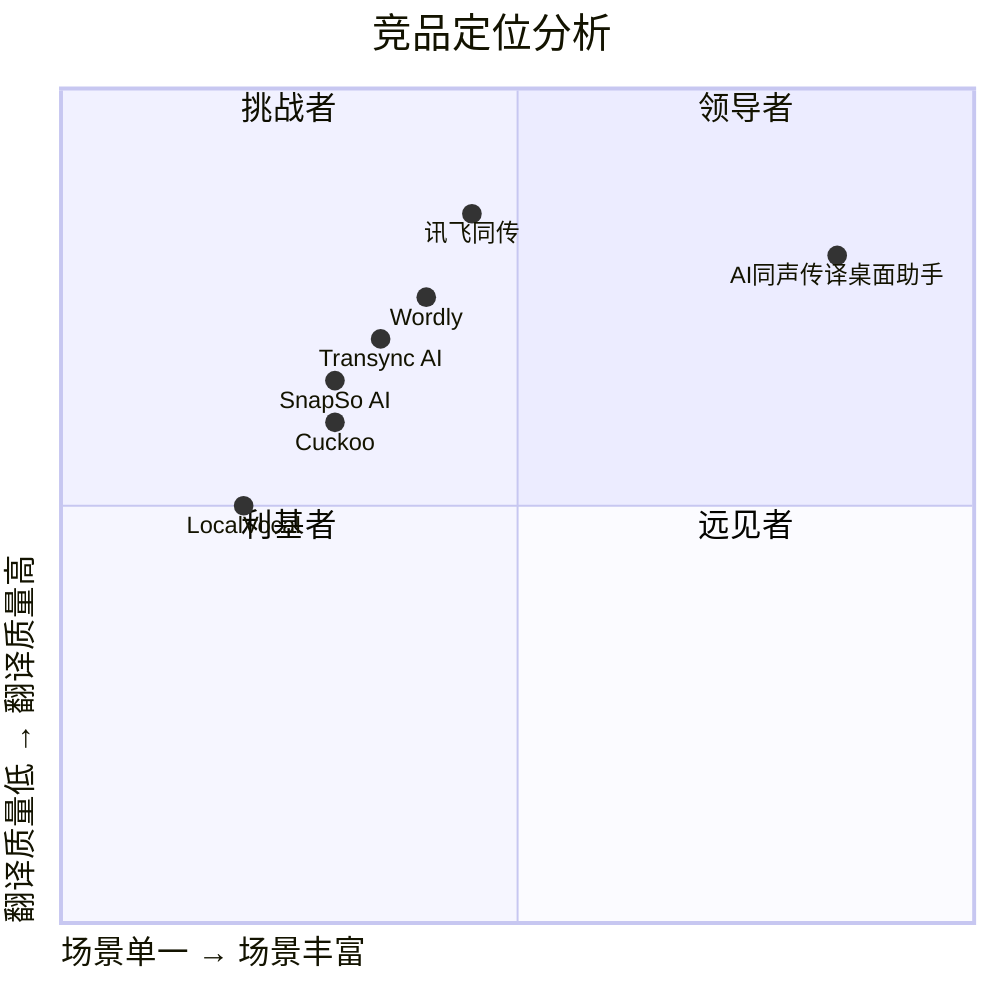

# AI 同声传译桌面助手 — 产品需求文档 (PRD)

> **文档版本**: v1.0  
> **作者**: Alice (Product Manager)  
> **日期**: 2025-06-05  
> **状态**: 草案 / 待评审

---

## 目录

1. [产品概述](#1-产品概述)
2. [用户画像与场景分析](#2-用户画像与场景分析)
3. [功能需求池](#3-功能需求池)
4. [UI 交互设计稿](#4-ui-交互设计稿)
5. [技术架构概要](#5-技术架构概要)
6. [非功能需求](#6-非功能需求)
7. [竞品分析](#7-竞品分析)
8. [待确认问题](#8-待确认问题)

---

## 1. 产品概述

### 1.1 产品愿景

打造一款**桌面端 AI 同声传译助手**，让任何语言的视频、直播、会议、面对面交流都能被用户无障碍理解。通过实时流式翻译 + AI 智能总结，帮助用户跨越语言门槛，高效获取信息。

### 1.2 产品定位

- **平台**: Windows / macOS 桌面应用
- **形态**: Electron 桌面客户端，支持系统托盘常驻
- **核心能力**: 实时语音采集 → ASR 识别 → LLM 流式翻译 → 字幕/语音输出 + AI 总结
- **差异化**: 覆盖 URL 视频、系统音频、麦克风三大输入场景的**一站式桌面同传方案**，且内置 AI 总结导出能力

### 1.3 目标用户

| 用户群体 | 典型场景 | 核心诉求 |
|---------|---------|---------|
| 技术从业者 | 观看国外技术演讲、开发者大会 | 快速理解英文技术内容 |
| 学生/研究人员 | 观看外文网课、学术讲座 | 跟上课程节奏，导出笔记 |
| 跨国商务人士 | 参加国际线上会议 | 实时获取翻译字幕 |
| 语言学习者 | 观看外文视频进行语言学习 | 对照原文与翻译 |
| 普通用户 | 浏览外网视频内容 | 降低语言门槛 |

### 1.4 核心价值主张

- **一听就懂**: 实时流式翻译，延迟 < 3 秒，字幕跟随音频同步呈现
- **一桶全收**: 无论视频 URL、系统声音还是麦克风拾音，一个应用全部覆盖
- **一看就会**: AI 自动总结，Markdown 格式输出，直接导入思维导图

---

## 2. 用户画像与场景分析

### 2.1 场景一：URL 视频分析

**用户故事**:

> **Story 1.1** — 作为技术开发者，我想粘贴一个 YouTube 技术演讲的链接，让系统自动下载音频、识别并实时翻译成中文字幕，这样我就能像看中文演讲一样理解内容。

> **Story 1.2** — 作为 B 站用户，我想输入 B 站外语视频链接，获取实时翻译字幕，同时保留原视频播放体验，这样我不需要切换平台就能理解外语内容。

> **Story 1.3** — 作为用户，我希望翻译完成后的字幕文本可以被 AI 自动总结成要点笔记，导出为 Markdown 格式，方便我在 XMind 中整理知识。

**用户流程**:

```
用户粘贴 URL → 系统通过 yt-dlp 提取音频流 → 
音频送入 ASR 引擎 → 流式输出原文文本 → 
LLM 实时翻译为中文 → 字幕叠加展示 →
翻译结束后 AI 生成结构化总结 → 导出 Markdown
```

**技术要点**:
- 使用 **yt-dlp** 提取视频音频流（支持 YouTube、B站、Vimeo 等数千站点）
- 支持浏览器 Cookie 导入（yt-dlp `--cookies-from-browser`），解决登录受限内容
- 音频流通过管道直接送入 ASR 引擎，无需等待完整下载

---

### 2.2 场景二：系统音频捕获

**用户故事**:

> **Story 2.1** — 作为在线学习者，我正在参加一个英语直播网课，想捕获系统播放的声音进行实时翻译，这样我就能跟上老师的讲课节奏。

> **Story 2.2** — 作为参会者，我在 Zoom/Teams 上参加国际会议，想将会议中的英文发言实时翻译成中文，并以浮动字幕形式显示在屏幕上。

> **Story 2.3** — 作为用户，我希望翻译历史自动保存，会后可以回顾整场会议的双语对照记录。

**用户流程**:

```
用户点击"系统音频"模式 → 系统通过 WASAPI Loopback (Windows) / 
BlackHole/Soundflower (macOS) 捕获系统音频 →
实时 ASR → 流式翻译 → 浮动字幕展示 →
翻译记录自动保存
```

**技术要点**:
- Windows: WASAPI Loopback 捕获系统音频输出
- macOS: BlackHole 虚拟音频驱动 或 ScreenCaptureKit 音频捕获
- 需要用户授权音频捕获权限

---

### 2.3 场景三：麦克风实时翻译

**用户故事**:

> **Story 3.1** — 作为商务人士，我与外国同事面对面交流时，打开应用通过麦克风采集对话，实时获取翻译字幕，让沟通更流畅。

> **Story 3.2** — 作为用户，我参加线下国际会议，希望将演讲者的发言通过麦克风采集后实时翻译，并通过大屏投屏展示给更多观众。

> **Story 3.3** — 作为用户，我希望翻译结果不仅能显示字幕，还能通过语音合成读出译文，让我可以"听"翻译而不是"看"翻译。

**用户流程**:

```
用户点击"麦克风"模式 → 系统请求麦克风权限 →
实时采集语音 → VAD 检测语音活动 → 
ASR + 翻译 → 字幕展示 + 可选 TTS 语音输出
```

---

## 3. 功能需求池

### 3.1 P0 — 核心功能（MVP 必须实现）

| ID | 功能 | 描述 | 验收标准 |
|----|------|------|---------|
| F01 | **URL 音频提取** | 通过 yt-dlp 解析 URL，提取音频流 | 支持 YouTube/B站/至少 5 个主流平台；提取成功率达 90%+ |
| F02 | **系统音频捕获** | 通过 WASAPI/BlackHole 捕获系统播放的音频 | Windows/macOS 均可稳定捕获，延迟 < 500ms |
| F03 | **麦克风音频采集** | 获取设备麦克风权限并采集音频 | 支持设备选择，支持 VAD 静音检测 |
| F04 | **实时 ASR 语音识别** | 将音频流实时转为原文文本 | 英文识别准确率 90%+（清晰语音）；延迟 < 2s 出首字 |
| F05 | **实时流式翻译** | 将识别文本实时翻译为中文 | 翻译延迟 < 3s (端到端)；支持流式逐词输出 |
| F06 | **字幕展示** | 原文+译文以字幕形式实时展示 | 滚动字幕，支持双语对照，自动跟随最新内容 |
| F07 | **翻译历史记录** | 自动保存完整翻译记录 | 支持会话级存储，会后可查看完整双语对照 |

### 3.2 P1 — 重要功能（MVP 后期或 V1.1）

| ID | 功能 | 描述 | 验收标准 |
|----|------|------|---------|
| F08 | **AI 智能总结** | 基于翻译文本自动生成 Markdown 结构化总结 | 支持三级标题分级，支持要点提取，中文输出 |
| F09 | **Markdown 导出** | 将总结导出为 .md 文件 | 文件可直接在 XMind/MindManager/Typora 中打开 |
| F10 | **自动修正** | 系统根据后续上下文自动修正之前的识别/翻译错误 | 修正延迟不超过 5s，修正结果在字幕中以差异样式标注 |
| F11 | **浮动字幕窗口** | 独立悬浮窗，始终置顶显示翻译字幕 | 支持拖拽、调整大小、透明度设置 |
| F12 | **多语种支持** | 支持英语→中文以外的语言对 | 至少支持中/英/日/韩互译 |
| F13 | **字幕样式自定义** | 支持字体大小、颜色、背景透明度调节 | 提供预设主题 + 自定义选项 |

### 3.3 P2 — 增强功能（V1.2+）

| ID | 功能 | 描述 |
|----|------|------|
| F14 | **TTS 语音合成输出** | 将翻译结果以语音形式朗读 |
| F15 | **大屏投屏模式** | 纯字幕投屏模式，适用于会议/教室场景 |
| F16 | **发言人区分** | 多人对话场景下的说话人分离 (Speaker Diarization) |
| F17 | **领域词库** | 支持加载专业领域词库（技术、医疗、法律等） |
| F18 | **快捷键控制** | 全局快捷键控制开始/暂停/切换模式 |
| F19 | **插件系统** | 支持第三方扩展输入源和输出目标 |
| F20 | **离线翻译** | 支持本地模型离线运行，无需网络 |

---

## 4. UI 交互设计稿

### 4.1 主界面布局

```
┌─────────────────────────────────────────────────┐
│  AI 同声传译桌面助手                    ─ ⬜ ✕   │
├─────────────────────────────────────────────────┤
│  ┌─────────────────────────────────────────┐    │
│  │  [URL] [系统音频] [麦克风]   ← 模式切换Tab │    │
│  └─────────────────────────────────────────┘    │
│                                                 │
│  ▼ 模式一：URL 输入区                           │
│  ┌─────────────────────────────────────────┐    │
│  │  🔗 请输入视频URL...           [▶ 开始]  │    │
│  └─────────────────────────────────────────┘    │
│                                                 │
│  ▼ 模式二/三：设备选择栏                        │
│  ┌─────────────────────────────────────────┐    │
│  │  🎤 麦克风: [设备下拉▼]  语种: [英文▼]   │    │
│  │  🎯 翻译目标: [中文▼]       [▶ 开始]    │    │
│  └─────────────────────────────────────────┘    │
│                                                 │
│  ┌─────────────────────────────────────────┐    │
│  │  📝 字幕区域 (可滚动)                    │    │
│  │                                         │    │
│  │  [EN] This is a real-time demo...       │    │
│  │  [ZH] 这是一个实时演示...                │    │
│  │  ─────────────────────────────          │    │
│  │  [EN] The system can translate speech   │    │
│  │  [ZH] 系统可以实时翻译语音               │    │
│  │  ─────────────────────────────          │    │
│  │  ...                                    │    │
│  └─────────────────────────────────────────┘    │
│                                                 │
│  ┌─────────────────────────────────────────┐    │
│  │  📊 AI 总结预览 (可折叠)                 │    │
│  │  ## 核心要点                             │    │
│  │  - 要点1...                              │    │
│  │  - 要点2...                              │    │
│  │                   [导出 Markdown] [复制] │    │
│  └─────────────────────────────────────────┘    │
├─────────────────────────────────────────────────┤
│  ⚙ 设置  |  📜 历史  |  📤 导出  |  ℹ 关于     │
└─────────────────────────────────────────────────┘
```

### 4.2 浮动字幕窗口

```
┌──────────────────────────────────┐
│  [EN] This is a live demo        │
│  [ZH] 这是一个实时演示            │
│  ─────────────────────────────── │
│  [EN] of AI interpretation       │
│  [ZH] 关于AI同声传译              │
│  ─────────────────────────────── │
│        ⚙ 透明度 ◐ ◑ ◯           │
└──────────────────────────────────┘
```

- 始终置顶，半透明背景
- 支持拖拽定位到任意屏幕位置
- 右下角快捷设置按钮

### 4.3 设置页面

```
┌─────────────────────────────────────────────────┐
│  设置                                    ◀ 返回  │
├─────────────────────────────────────────────────┤
│                                                 │
│  🔤 字幕设置                                    │
│  ├─ 字体大小:    [─────●─────] 16px             │
│  ├─ 原文颜色:    [■ 白色 ▼]                     │
│  ├─ 译文颜色:    [■ 黄色 ▼]                     │
│  ├─ 背景透明度:  [──●────────] 80%              │
│  └─ 最大行数:    [10 ▼]                         │
│                                                 │
│  🤖 AI 引擎设置                                 │
│  ├─ ASR 引擎:    [Whisper ▼]                    │
│  ├─ 翻译引擎:   [GPT-4o ▼]                      │
│  ├─ API Key:     [••••••••••••••] [测试连接]    │
│  └─ 模型:        [gpt-4o ▼]                     │
│                                                 │
│  🎤 音频设置                                    │
│  ├─ 输入设备:    [默认麦克风 ▼]                  │
│  ├─ VAD 灵敏度:  [────●──────] 中等             │
│  └─ 采样率:      [16000 Hz ▼]                   │
│                                                 │
│  ⌨ 快捷键                                      │
│  ├─ 开始/暂停:   [Ctrl+Shift+T]                 │
│  └─ 切换模式:    [Ctrl+Shift+M]                 │
│                                                 │
│  📦 导出设置                                    │
│  └─ 默认格式:    [Markdown ▼]                   │
│                                                 │
└─────────────────────────────────────────────────┘
```

---

## 5. 技术架构概要

### 5.1 技术栈建议

| 层次 | 技术选型 | 说明 |
|------|---------|------|
| 桌面框架 | **Electron** 或 **Tauri** | Electron 生态成熟，Tauri 体积更小 |
| 前端 | React + TypeScript + Tailwind CSS | 现代前端栈，组件化开发 |
| 音频捕获 (Win) | WASAPI Loopback | Windows 原生系统音频捕获 |
| 音频捕获 (Mac) | BlackHole / ScreenCaptureKit | macOS 系统音频方案 |
| 麦克风采集 | Web Audio API / MediaDevices | 浏览器原生能力 |
| 视频音频提取 | **yt-dlp** (子进程调用) | 支持 1000+ 网站 |
| ASR 引擎 | OpenAI Whisper (API 或本地) | whisper_streaming 实现低延迟 |
| 翻译引擎 | OpenAI GPT-4o / Claude / DeepSeek | 流式 API 逐词翻译 |
| TTS | Edge TTS / OpenAI TTS | 语音合成输出 |
| 本地存储 | SQLite / IndexedDB | 翻译历史、设置持久化 |

### 5.2 数据流

```
┌──────────┐    ┌──────────┐    ┌──────────┐    ┌──────────┐
│ 音频源    │ → │ ASR 引擎  │ → │ 翻译引擎  │ → │ 字幕/语音 │
│ (URL/系统 │    │ (Whisper) │    │ (LLM)    │    │ 输出      │
│  音频/麦克)│    │           │    │          │    │          │
└──────────┘    └──────────┘    └──────────┘    └──────────┘
                     │               │
                     ▼               ▼
                ┌──────────────────────┐
                │  文本缓冲区           │
                │  (原文 + 译文)        │
                └──────────┬───────────┘
                           │
                           ▼
                ┌──────────────────────┐
                │  AI 总结引擎          │
                │  (Markdown 分级汇总)  │
                └──────────┬───────────┘
                           │
                           ▼
                ┌──────────────────────┐
                │  导出文件 (.md)       │
                └──────────────────────┘
```

### 5.3 延迟预算

| 环节 | 目标延迟 | 备注 |
|------|---------|------|
| 音频捕获 → ASR 输入 | < 200ms | 缓冲区大小决定 |
| ASR 首字输出 | < 1.5s | whisper_streaming 可到 3.3s，持续优化 |
| 翻译首字输出 | < 1s | LLM streaming API |
| **端到端总延迟** | **< 3s** | 从说话到看到译文 |

---

## 6. 非功能需求

### 6.1 性能要求

| 指标 | 目标值 | 说明 |
|------|-------|------|
| 端到端翻译延迟 | < 3 秒 | 从说话到显示译文 |
| ASR 英文准确率 | ≥ 90% (清晰语音) | Word Error Rate |
| ASR 中文准确率 | ≥ 93% | Character Error Rate |
| 翻译忠实度 | 人工评估 ≥ 4/5 | 信息完整 + 流畅自然 |
| CPU 占用 (空闲) | < 5% | 不翻译时 |
| CPU 占用 (翻译中) | < 30% | 使用本地 ASR 时 |
| 内存占用 | < 500MB | 含 Electron runtime |
| 安装包大小 | < 200MB | 不含本地模型 |

### 6.2 可靠性

- **断线重连**: 网络中断后自动恢复，从断点继续
- **错误降级**: API 不可用时，提示用户切换备用引擎或使用本地模型
- **崩溃恢复**: 应用崩溃后自动恢复上次会话的翻译记录
- **音频设备热插拔**: 设备插拔后自动切换，无需重启应用

### 6.3 安全性

- API Key 本地加密存储（使用系统密钥链）
- 不上传用户音频到未经用户授权的第三方服务器
- 翻译记录加密存储于本地
- 不包含任何遥测/数据收集（除非用户主动开启）

### 6.4 可扩展性

- 支持通过配置切换 ASR 引擎（Whisper / 讯飞 / Azure）
- 支持通过配置切换翻译引擎（GPT / Claude / DeepSeek）
- 预留插件接口（输入源插件、输出目标插件）

### 6.5 兼容性

| 平台 | 最低版本 |
|------|---------|
| Windows | Windows 10 (22H2+) |
| macOS | macOS 13 (Ventura)+ |
| 架构 | x64, ARM64 (Apple Silicon) |

---

## 7. 竞品分析

### 7.1 竞品概览

| 产品 | 类型 | 核心能力 | 优势 | 劣势 |
|------|------|---------|------|------|
| **讯飞同传** | 桌面客户端 | 会议同传、字幕投屏 | 60语种、专业词库、稳定性高 | 偏会议场景，不支持URL视频；免费额度有限 |
| **Transync AI (同言翻译)** | 桌面客户端 | AI实时翻译、TTS | 大语音模型优化、低延迟 | 新兴产品，功能覆盖尚不完整 |
| **SnapSo AI翻译** | 桌面客户端 | 文本翻译、OCR翻译 | 集成多家大模型、截图翻译便捷 | 偏文本翻译，不支持实时语音流 |
| **Wordly** | Web/SaaS | 会议实时翻译 | 免安装、多平台 | 按分钟收费昂贵；需联网；缺少桌面端系统音频捕获 |
| **Cuckoo** | 桌面客户端 | 会议实时翻译 | 界面友好、多语种 | 仅面向会议场景 |
| **LocalVocal (OBS插件)** | OBS 插件 | 本地实时字幕 | 免费开源、本地运行、无网络需求 | 依赖 OBS，非独立应用；仅英文识别；不支持 URL 视频 |
| **whisper_streaming** | 开源库 | 实时 ASR | 3.3s 超低延迟、可自部署 | 仅为 ASR 库，需自行构建应用层 |

### 7.2 竞争象限图



> 说明：本产品定位为「场景丰富 × 翻译质量高」的远见者象限，以**URL视频 + 系统音频 + 麦克风**三合一场景覆盖为差异化，结合 AI 总结能力形成完整闭环。

### 7.3 差异化定位

| 维度 | 竞品现状 | 本产品策略 |
|------|---------|-----------|
| **输入源** | 多数竞品仅支持麦克风或会议集成 | **三源合一**：URL视频 + 系统音频 + 麦克风 |
| **视频分析** | 无竞品提供 URL→音频→翻译 完整链路 | **yt-dlp 深度集成**，一键提取+翻译 |
| **AI 总结** | 讯飞有会议纪要，其他基本无 | **Markdown 分级总结 + 思维导图导入** |
| **自动修正** | 几乎没有产品做实时修正 | **上下文感知修正**，提升翻译准确性 |
| **本地运行** | 仅 LocalVocal 支持，但功能有限 | **可选本地/云端**，兼顾性能与隐私 |

---

## 8. 待确认问题

以下是需要与团队和决策者确认的关键问题：

### 技术决策 ✅ 已确认

| # | 问题 | 决策 | 说明 |
|---|------|------|------|
| Q1 | **桌面框架** | **Electron** | 音频 API 兼容性更好，生态成熟 |
| Q2 | **ASR 引擎策略** | **纯云端 Whisper API**（V1） | 零部署，降低 MVP 复杂度 |
| Q3 | **翻译引擎** | **DeepSeek** | 默认引擎，V1.1+ 支持用户切换 |
| Q4 | **yt-dlp 部署方式** | **捆绑安装** | 开箱即用，降低使用门槛 |

### 产品决策 ✅ 已确认

| # | 问题 | 决策 | 说明 |
|---|------|------|------|
| Q5 | **商业模式** | **开源比赛项目** | 暂不考虑商业化 |
| Q6 | **移动端支持** | **仅桌面端**（V1） | Windows + macOS |
| Q7 | **开源策略** | **开源** | 比赛项目 |
| Q8 | **账号系统** | **不需要**（V1） | 纯本地应用 |

### 风险点

| # | 风险 | 影响 | 缓解措施 |
|---|------|------|---------|
| R1 | yt-dlp 在某些平台可能因反爬策略失效 | 核心功能不可用 | 定期更新 yt-dlp；支持手动上传音频文件作为降级方案 |
| R2 | LLM API 成本高，用户使用频率高时花费大 | 用户体验差 | 支持 BYOK；提供本地模型选项；合理计费策略 |
| R3 | 系统音频捕获在不同 OS 版本兼容性问题 | 功能不可用 | 充分测试；提供降级方案（虚拟音频设备引导） |
| R4 | 实时翻译在弱网环境下延迟过大 | 体验差 | 支持离线本地模型；网络质量检测与提示 |

---

## 附录

### A. 术语表

| 术语 | 全称 | 说明 |
|------|------|------|
| ASR | Automatic Speech Recognition | 自动语音识别 |
| VAD | Voice Activity Detection | 语音活动检测 |
| TTS | Text-to-Speech | 文本转语音 |
| WASAPI | Windows Audio Session API | Windows 音频会话 API |
| yt-dlp | - | 开源视频/音频下载工具 |
| PRD | Product Requirement Document | 产品需求文档 |
| MVP | Minimum Viable Product | 最小可行产品 |
| BYOK | Bring Your Own Key | 自带 API 密钥 |

### B. 参考链接

- yt-dlp: https://github.com/yt-dlp/yt-dlp
- Whisper Streaming: https://github.com/ufal/whisper_streaming
- LocalVocal (OBS): https://github.com/royshil/obs-localvocal
- Realtime Caption: https://github.com/ShigetoshiMizuno/realtime-caption
- 讯飞同传: https://iflyrec.com
- Transync AI: https://www.transyncai.com
- SnapSo AI: https://snapso.ai
